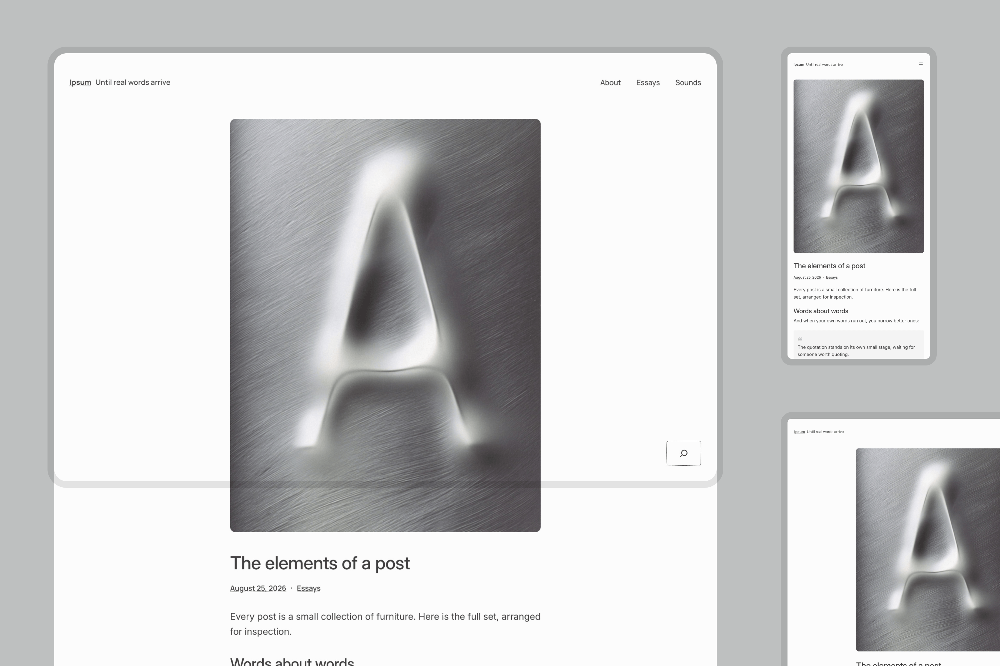
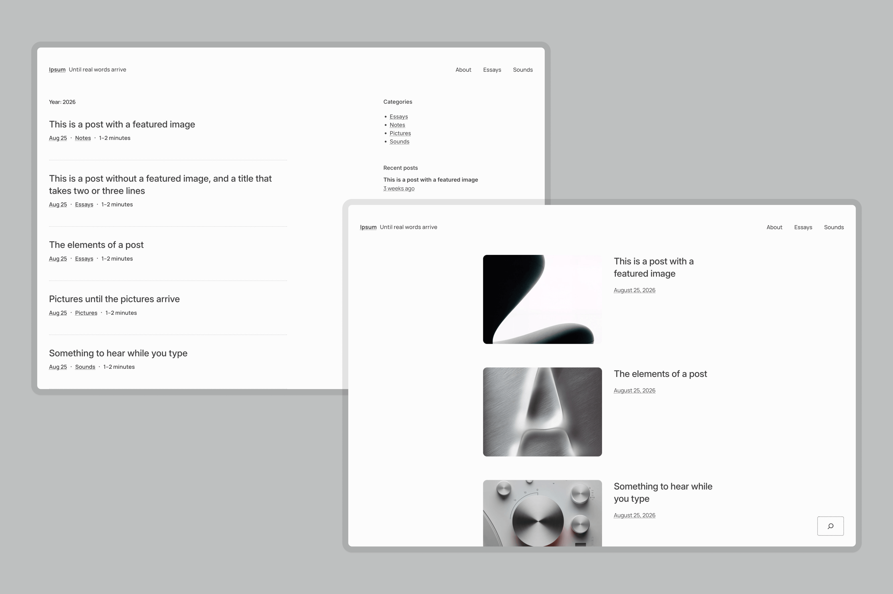
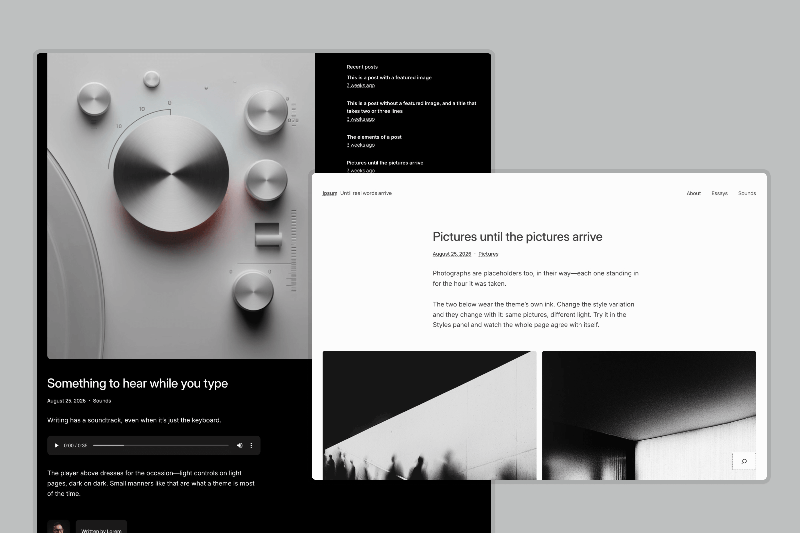
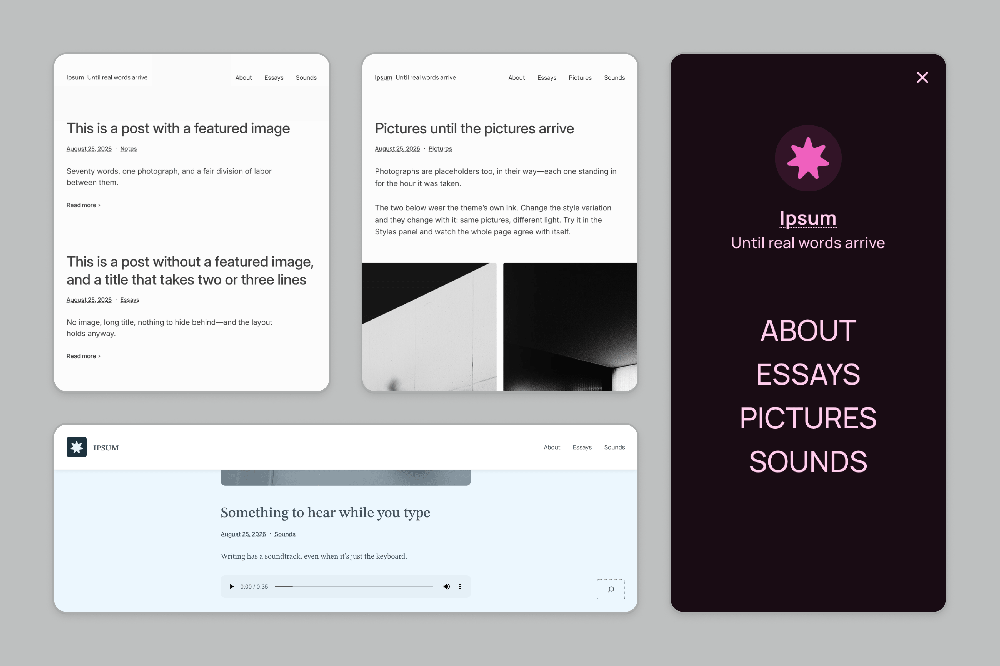

# Ipsum

Ipsum is a blank canvas built around the blogging experience, our proposal for what a default theme should be. Named after *lorem ipsum*, the placeholder that fills a page until real content arrives, it is composed enough to stand on its own and to be transformed the moment people start writing.


## Try Ipsum

- **[Open Ipsum in WordPress Playground](https://playground.wordpress.net/?blueprint-url=https://raw.githubusercontent.com/WordPress/ipsum/trunk/.github/blueprint.json)** — a throwaway WordPress in your browser with Ipsum active and the demo content already imported. Nothing to install; close the tab and it's gone.
- **[Browse the demo site](https://ipsum.mystagingwebsite.com/)** — the theme with the same content, hosted.
- **Install it** — download this repository as a ZIP (Code → Download ZIP) or clone it into `wp-content/themes/ipsum`, then activate Ipsum under Appearance → Themes. Requires WordPress 7.1 or later and PHP 7.2 or later.

## Demo content

The posts and pages used in the screenshots and the demo site are in [`ipsum-demo-content.xml`](.github/ipsum-demo-content.xml). Import them on a test site via Tools → Import → WordPress. The Playground link above loads them for you.

## A closer look










## About this project

Ipsum is being developed in the open. Feedback is welcome — [open an issue](https://github.com/WordPress/ipsum/issues) with anything you find, from bugs to design notes. The style variations, the archive pattern pack, and the sidebar templates are the areas where testing helps most right now.

Two conventions for contributors: the theme version stays at 1.0.0 while Ipsum is in development, and changes are logged in pull request descriptions rather than a changelog.

### Checking your changes

Pull requests are linted in CI. To run the same checks locally, you need PHP with [Composer](https://getcomposer.org/), and Node.js 24.18 or later with npm 11.16 or later — `nvm use` picks the version in `.nvmrc`.

```sh
composer install
npm install
npm run lint
```

- `npm run lint:php` checks PHP against the WordPress Coding Standards; `npm run lint:php:fix` fixes what it can.
- `npm run lint:theme` checks the pattern headers and the block markup in patterns, templates, and template parts, and validates `theme.json` and the style variations against the schema for the theme's "Requires at least" version.

## License

Ipsum is licensed under the [GNU General Public License v2 or later](http://www.gnu.org/licenses/gpl-2.0.html). Bundled fonts are licensed under the SIL Open Font License; details in [readme.txt](readme.txt).
